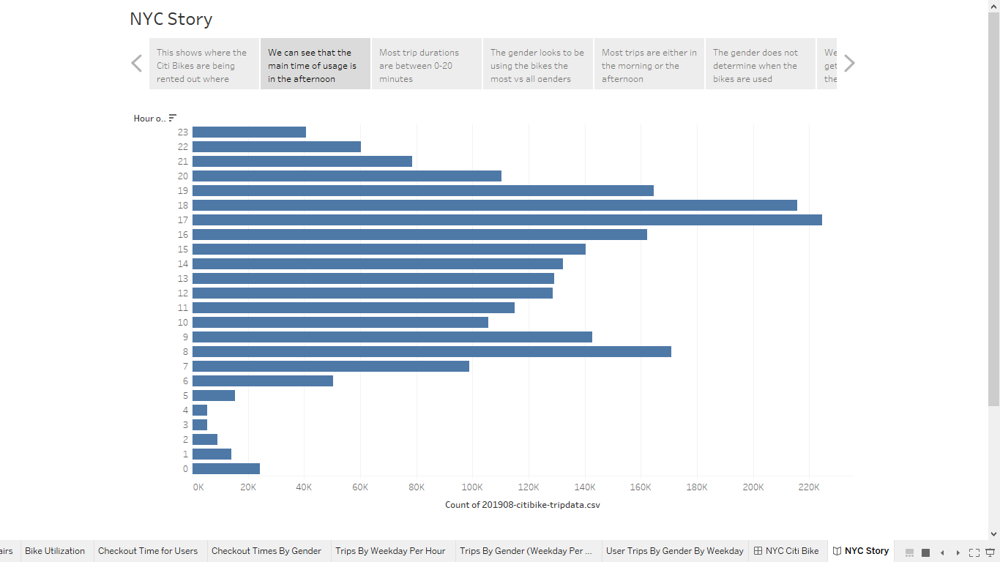

# bikesharing
## Overview of the analysis
For this assignment using Tableau I created visual aids showing the tendencies of **CitiBike** customers behave in the month of August. I got the information from a csv file downloaded from the **CitiBike** website during their peak month of August. After, creating these visual aids I created a story, using Tableau, to show the results of the analysis that was done. Using the information seen; we can use that as a reference to help with a bike riding system in Des Moines. 

[Link to the DashBoard](https://public.tableau.com/profile/yaser.kassam#!/vizhome/NYCitibikeStory/NYCStory)

## Results
In my story there are 7 different visual aids to show what customer tendencies are and trends that were seen after creating them.

The image above shows in NYC where the top locations where customers would pick up the bike (starting location). In New York, many of the places where the bike would be picked is in central Manhattan. This is where there a lot of commuters and foot traffic. Similarily, in Des Moines we would know that there would need to be more bike sharing locations near where there is many commuters and travelers.

The second image shows that there are certain times of the day that there are more usage than others. Usually, the thought is the most usage would be in the morning. However, the chart above indicates that this is incorrect. The most usage comes in the window between 4p-7p. This can be inferred as when customers would get off of work, as potentially people wanting to get home as quickly as possible.

The next picture shows the duration of each trip. As seen in the line chart above most trips last between 0-20 minutes. This shows that there are a lot of trips that are short which lead to bikes being used more. 

The image above shows the breakdown between gender and trip duration. All three genders male, female, and unknown show the same characteristics that the ride duration is between 0-20 minutes. However, what we are seeing is that there are more people whon identify as male using the bike sharing service.

The next graph shows when we are seeing the bike trips by weekday for each hour. We can see most of the trips are happening in the 4p-7p window from Monday-Friday. Also, we can see on Saturday and Sunday they more or less evenly distributed between 10a-7p.

The next graph shows weekday usage by gender. We can see the distribution looks similar as the oprevious graph. However, when using Tableau and filtering the genders we see that male riders are using it more on the weekdays. While, female riders are using the riding service more on the weekends.

Lastly, we can see the people that are using it between regular customers and subcribers. On the graph the darker the shade of blue the more people are using it. We can see that people who are wubscrubers to the CitiBike service are more likely to use the service rather that those who are not. Also, we can see the heavy subscriber usage is with people identfying as male.

## Summary
Based upon the information that I have gathered we can conclude many things with the use of Tableau. First, we see that the main customers that are using the biking service are male. Next, we have determined that using NYC Citibike data that many of the bikes that are being used are coming from high traffic areas. Also, we see that if we have a subscruber program that the customer is more likely to use the bikes and this will lead to constant flow of revenue. Using the graphs, we can see how we can plan out maintenance on the bikes by looking at the low usage times and also where more bikes need to be rather then other areas. Lastly, with trip duration being short we have more people using the bikes making people more likely to use it because there is no wait and ample amount of bikes to use.

There can be more visualizations created to answer more questions that may pccur. Another visualization can be since more of our customers are male. We can look to see if there are certain locations where they are starting their ride verse others. Such as aif more are using the service near mass transit or certain landmarks. Another, is using the bike id to see which bike has a lot of wear and tear so we can have maintenance on them and see if they are being used more because of where they are located.
